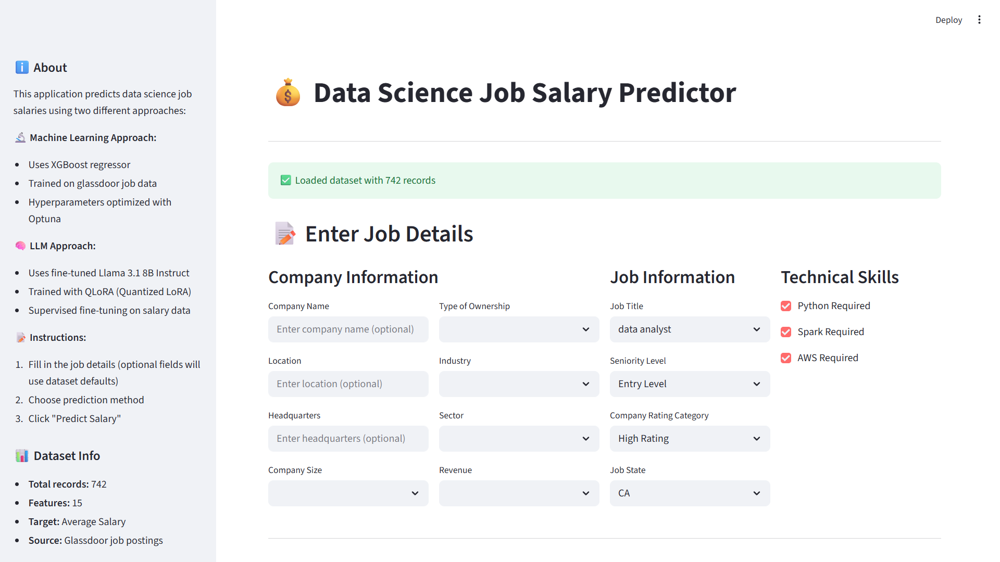
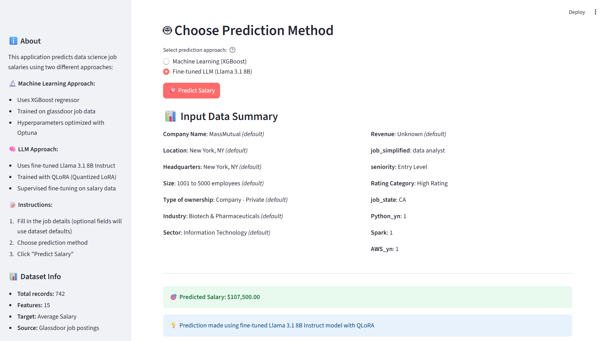

# Glassdoor 2024 Data Science Job Salary Prediction 

## Table of Contents  
- [📌 Overview](#-overview)
- [🧑‍💻 Tech Stack](#-tech-stack)
- [⭐ Key Features](#-key-features)
- [⚙️ Installation & Usage](#️-installation--usage)
- [📂 Project Structure](#-project-structure)
- [📫 Contact](#-contact)

## 📌 Overview  

<div align="center">
  
  
</div>

This project aims to predict data science job salaries using multiple modeling approaches, leveraging 2024 Glassdoor job data. The application provides salary predictions through both traditional machine learning methods and cutting-edge large language model (LLM) techniques, offering users a comprehensive comparison of different predictive modeling paradigms.

The project targets data science professionals, recruiters, and researchers interested in salary analysis and prediction methodologies. It addresses the challenge of accurately estimating data science salaries by incorporating various job-related features and exploring the potential of LLMs in regression tasks. The interactive Streamlit application makes salary prediction accessible to both technical and non-technical users.

👉 Fine-tuned LLaMA 3.1 QLoRA model is available here: [YuITC/llama31-8b-ins-qlora-sft](https://huggingface.co/YuITC/llama31-8b-ins-qlora-sft)

## 🧑‍💻 Tech Stack  

> Selenium, Pandas, NumPy, Scikit-learn, XGBoost, Optuna, PyTorch, Transformers, PEFT (QLoRA), SFT, OpenAI SDK, Hugging Face, Weights & Biases

- **Data Collection & Processing**: Selenium for web scraping, Pandas and NumPy for data manipulation
- **Machine Learning**: Scikit-learn for preprocessing, XGBoost for gradient boosting, Optuna for hyperparameter optimization
- **Deep Learning & LLMs**: PyTorch for deep learning framework, Transformers and PEFT for model handling, QLoRA for efficient fine-tuning
- **LLM Services**: OpenAI GPT-5 SDK for few-shot prompting, Hugging Face for model hosting and fine-tuning
- **Visualization**: Matplotlib and Seaborn for data visualization and analysis
- **Deployment**: Streamlit for interactive web application, Weights & Biases for experiment tracking
- **Development Tools**: Jupyter Notebooks for experimentation, Python 3.10 for development environment

## ⭐ Key Features  

- **Comprehensive Data Pipeline**: Crawled 2024 Glassdoor Data Science jobs and performed comprehensive preprocessing, EDA, and feature engineering
- **High-Performance ML Model**: Achieved R² = 0.82 using XGBoost, significantly outperforming the Linear Regression baseline (R² = 0.71)
- **Advanced Hyperparameter Optimization**: Enhanced XGBoost predictive performance and robustness through advanced hyperparameter tuning with Optuna
- **LLM Integration**: Experimented with LLM-based regression approaches via few-shot prompting with OpenAI's GPT-5 SDK and supervised fine-tuning (SFT + QLoRA) with LLaMA 3.1
- **Multi-Model Comparison**: Benchmarked model performance across traditional ML, few-shot LLMs, and fine-tuned LLMs
- **Interactive Web Application**: Built a salary prediction Streamlit app based on the three modeling approaches for easy accessibility

## ⚙️ Installation & Usage  

### Prerequisites
- Python 3.10
- GPU support for LLM inference (recommended)
- Required API keys: `OPENAI_API_KEY`, `HF_TOKEN`, `WANDB_API_KEY`

### Installation Steps

1. **Clone the repository**
   ```bash
   git clone https://github.com/YuITC/2024-DataScience-Salaries-Analysis.git
   cd 2024-DataScience-Salaries-Analysis
   ```

2. **Create and activate virtual environment**
   ```bash
   python -m venv venv
   venv\Scripts\activate  # On Windows
   # source venv/bin/activate  # On macOS/Linux
   ```

3. **Install dependencies**
   ```bash
   pip install -r requirements.txt
   ```

4. **Set up environment variables**
   Create a `.env` file in the root directory:
   ```env
   OPENAI_API_KEY=your_openai_api_key
   HF_TOKEN=your_hugging_face_token
   WANDB_API_KEY=your_wandb_api_key
   ```

### Usage

1. **Run the Streamlit application**
   ```bash
   streamlit run app.py
   ```

2. **Explore Jupyter notebooks** (optional)
   ```bash
   jupyter notebook notebooks/
   ```

3. **Run data crawling** (optional)
   ```bash
   jupyter notebook crawler.ipynb
   ```

## 📂 Project Structure  

```
├── app.py                                    # Main Streamlit application
├── crawler.ipynb                             # Web scraping notebook for Glassdoor data
├── requirements.txt                          # Python dependencies
├── LICENSE                                   # Project license
├── assets/                                   # Assets folder
│   ├── demo1.png
│   └── demo2.png
├── data/
│   ├── glassdoor_jobs.csv                    # Raw scraped job data
│   ├── data_EDA.csv                          # Processed data for EDA
│   ├── data_model.csv                        # Final dataset for model training
│   └── data_sft/                             # Fine-tuning datasets
│       ├── train.json
│       ├── val.json
│       └── test.json
├── notebooks/
│   ├── 1-Preprocessing-and-Observation.ipynb # Preprocessing notebook
│   ├── 2-EDA-and-Feature-engineering.ipynb   # EDA notebook
│   ├── 3-Machine-Learning-approach.ipynb     # ML approach notebook
│   ├── 4-LLM-Few-shots-prompting.ipynb       # LLM few-shots prompting notebook
│   └── 5-SFT-QLoRA.ipynb                     # SFT + QLoRA notebook
└── outputs/                                  # Model outputs and results
    └── optuna_xgboost/
        └── xgb_optuna_tuning.pkl             # Trained XGBoost model
```

## 📫 Contact  

If you find this project useful, consider ⭐️ starring the repository or contributing to further improvements!

For any questions, feature requests, or collaboration opportunities, feel free to reach out: tainguyenphu2502@gmail.com
